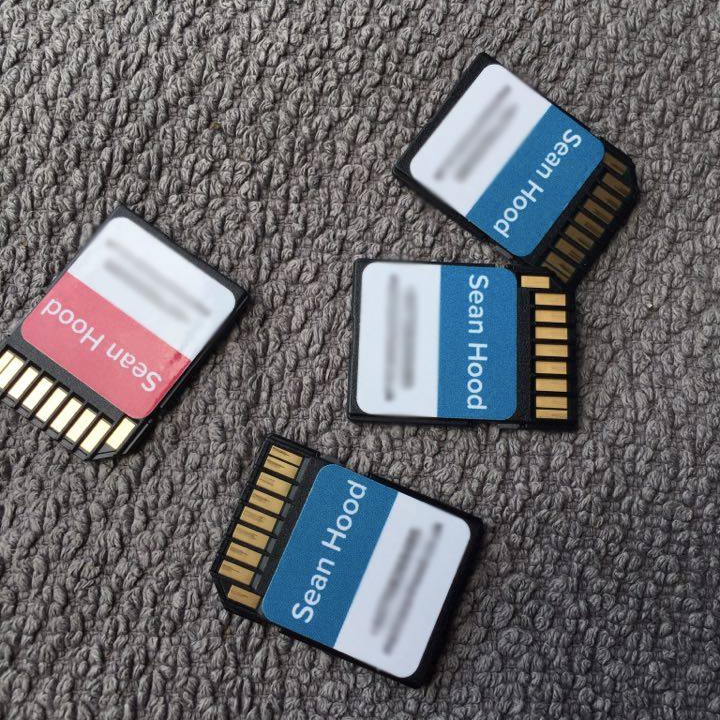

# Moo SVG Mini Stickers

This is designed for the [Moo StickerBook](https://www.moo.com/uk/products/stickerbooks.html), they can probably be adapted for their other stickers.

I needed some basic stickers I could stick on various things I own, so if I lent out the item or lost it, it'd hopefully make it back my way.

Figured I could also learn how to make SVG's in the process so here we are.

Note: The typeface I used is non-free so can't be included.

## How to

1. Edit the moo.svg in your favourite text editor
1. Preview in a web browser or macOS's quick look thing
1. Export the svg to png with the following command on macOS:
    ```
    qlmanage -t -s 1000 -o . moo.svg
    ```

## Example



See `moo.svg.png` for an exported version of `moo.svg`

## Licence 

This work is licensed under a Creative Commons Attribution-ShareAlike 4.0 International License.